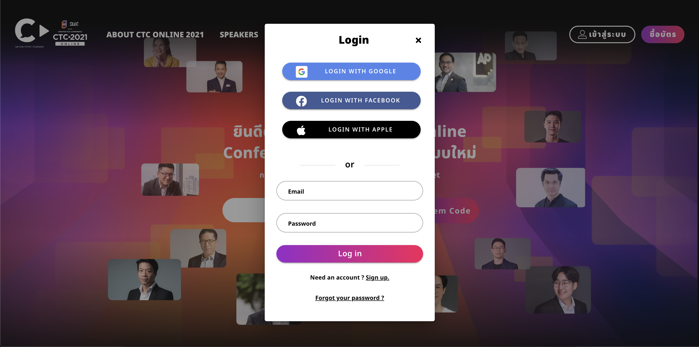
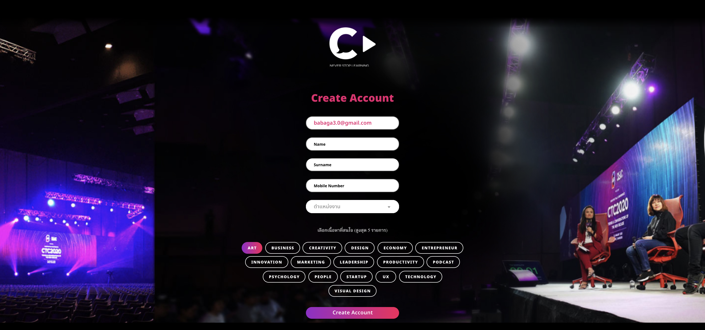
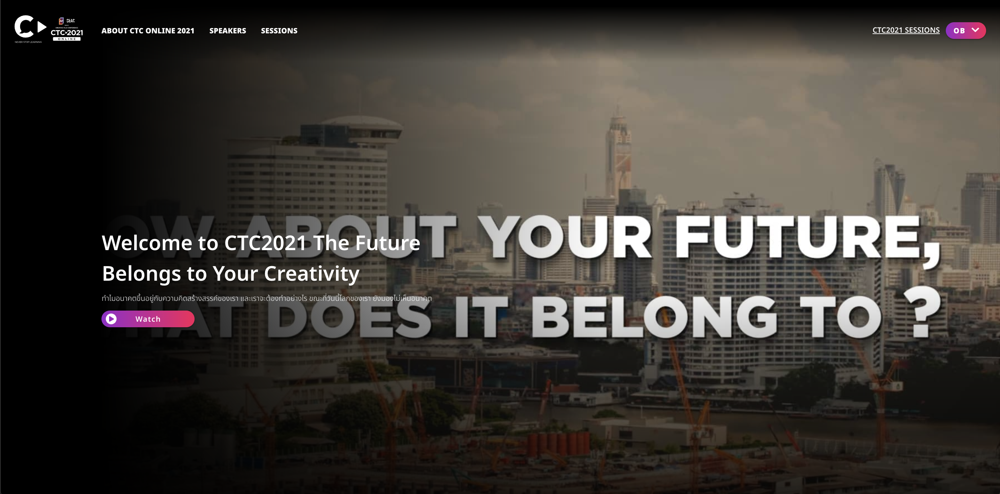

# New CreativeTalk site journey

## Init

ทำการเรียก `init()` ก่อนใช้ function อื่นๆภายใน `SDK`

```js
// init example
growth.init();
```

## Registration
**1. ก่อนจะ register user จะเป็น anonymous (ยังไม่ต้องการข้อมูล)**



<p align="center">ภาพ 1: หน้า login/registration ในจังหว่ะนี้ user จะมีสถานะเป็น anonymous</p>
<br>

**2. เมื่อทำการสมัครเสร็จแล้วควรมีการส่งข้อมูลการสมัครมายัง `Growth`**



<p align="center">ภาพ 2: หน้าการกรอกข้อมูล user สามารถส่งข้อมูลผ่าน sdk ตอนที่กด "create account"</p>
<br>



<p align="center">ภาพ 3: หรือสามารถทำการส่งข้อมูลหลังจากถูก redirect มาทีหน้านี้พร้อม query param ก็ได้</p>
<br>

ตัวอย่างการใช้ SDK เพื่อ register user นี้บน `Growth`

```js
// register example
await growth.createContact({
  email: "xxx@gmail.com",
  firstname: "firstname",
  lastsurname: "lastname",
  mobile: "0949848444",
  position: "engineer",
});
```

```js
growth.sentEvent({
  custom_action: "registration",
  custom_title: "registration",
  custom_category: "registration",
});
```
## Login

**1. ก่อนจะ login user จะเป็น anonymous (ยังไม่ต้องการข้อมูล)**


<p align="center">ภาพ 4: หน้า login/registration ในจังหว่ะนี้ user จะมีสถานะเป็น anonymous</p>
<br>

**2. เมื่อทำการ login เสร็จแล้วควรมีการส่งข้อมูลการสมัครมายัง `Growth`**

```js
// login example
await growth.login({
  email: "xxx@gmail.com",
  firstname: "firstname",
  lastname: "lastname",
});
```

```js
growth.sentEvent({
  custom_action: "login",
  custom_title: "login",
  custom_category: "login",
});
```

## Session visit

ในหน้า session นั้นจะสามารถมี action ได้ด้วยกันสามอย่างได้แก่ 
- pageview
- video click
- video end


<p align="center">ภาพ 5: หน้า session</p>
<br>

**1. เมื่อ session page ได้รับการเข้าชม** 

```js
// watch click example
growth.sentEvent({
  custom_type: "session",
  custom_category: "creative",
  custom_title: "ctc-2021_e-commerce-trends-2021",
  custom_action: "pageview",
  custom_track_year: "2021",
  custom_speaker: "ธนาวัฒน์ มาลาบุปผา",
});
```

**2. เมื่อ ปุ่ม watch ถูกกด**

```js
// watch click example
growth.sentEvent({
  custom_type: "session",
  custom_category: "creative",
  custom_title: "ctc-2021_e-commerce-trends-2021",
  custom_action: "video_click",
  custom_track_year: "2021",
  custom_speaker: "ธนาวัฒน์ มาลาบุปผา",
});
```

**3. เมื่อ ชม video จนจบ**

```js
// watch end example
growth.sentEvent({
  custom_type: "session",
  custom_category: "creative",
  custom_title: "ctc-2021_e-commerce-trends-2021",
  custom_action: "video_end",
  custom_track_year: "2021",
  custom_speaker: "ธนาวัฒน์ มาลาบุปผา",
});
```

> หมายเหตุ: กรณีที่มี speaker หลายคน หรือมี category หลายชนิดเราสามารถ ขัั้นข้อมูลได้ด้วย `|` เช่น `custom_category: "creative|lifestyle|...",` และ `custom_speaker: "ธนาวัฒน์ มาลาบุปผา|จอนนี่ บราวโว้|...",`