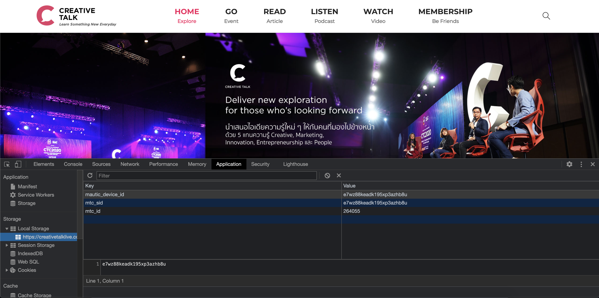
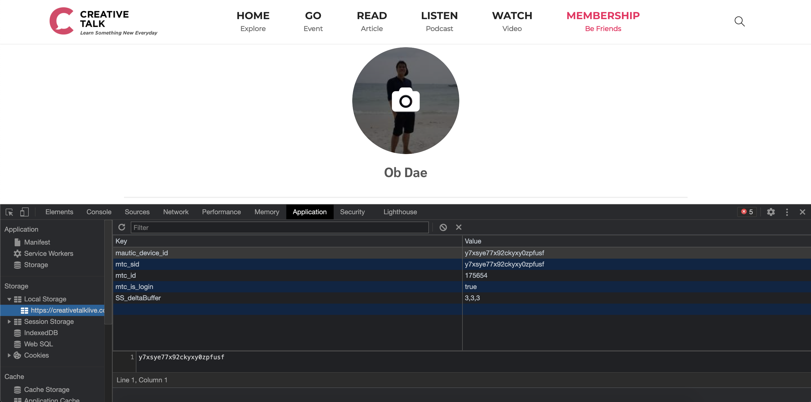
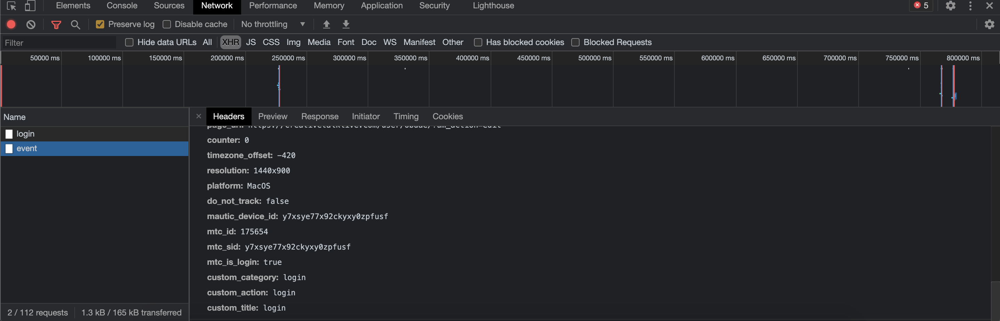
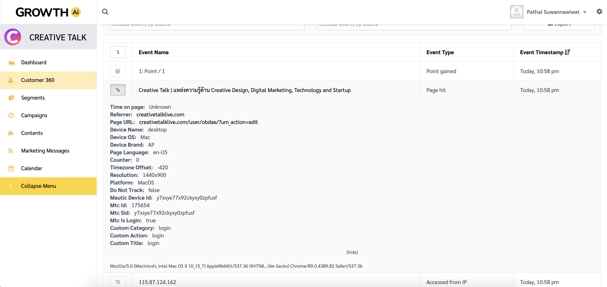
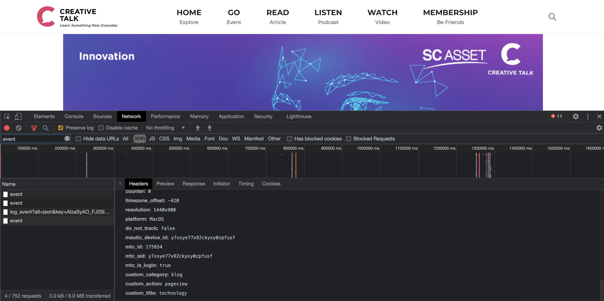
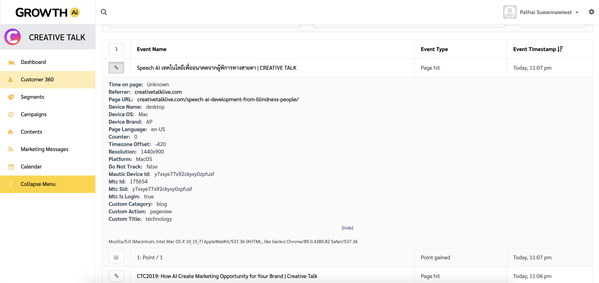
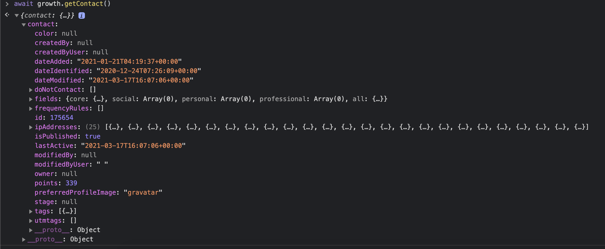

# GROWTH Client SDK

`Growth SDK` คือชุดเครื่องมือที่สามารถใช้ในการพัฒนาเว็บแอปพลิเคชัน โดยภายใน SDK จะประกอบไปด้วยชุดคำสั่งต่างๆเพื่อใช้ทำการเชื่อมต่อกับระบบ `GrowthAI`

## ชุดคำสั่งภายใน SDK

init
----

ใช้สำหรับเปิดการเชื่อมต่อกับระบบ `GrowthAI`

```js
// ตัวอย่างการเรียกใช้งาน
growth.init();
```


<p style="text-align: center;">เมื่อคำสั่ง init() ทำงานสำเร็จจะพบว่ามี token ของ user ถูกบันทึกไว้ภายใน localStorage</p>


<b>ขั้นตอนการทำงาน</b>
1. ทำการติดตั้ง `mtc.js` script ลงบน website.
2. ทำการเพิ่ม `mtc` token ลงบน `localStorage` และ `cookie`

login
---

SDK จะทำการบันทึกข้อมูลของ user ลงบน `localStorage`.

```js
// ตัวอย่างการเรียกใช้งาน
await growth.login({ firstname, lastname, email });
```


<p style="text-align: center;">เมื่อคำสั่ง login() ทำงานสำเร็จเราจะพบว่า token ของ user จะถูก update และมี flag mtc_is_login = true</p><br/>


<p style="text-align: center;">เราสามารถตรวจสอบ event และข้อมูลที่ถูกส่งไปยัง GrowthAI ได้</p><br/>


<p style="text-align: center;">เมื่อข้อมูลถูกส่งมาจนถึง GrowthAI เราจะเห็นว่ามีข้อมูลของ event ล่าสุดบันทึกไปยัง 360</p>

sentEvent
---

คำสั่ง `sentEvent` ใช้ในการส่งข้อมูล event ใหม่ไปยัง `Growth`.

```js
// ตัวอย่างการเรียกใช้งาน
growth.sentEvent({ ...payload });
```


<p style="text-align: center;">เมื่อ user เข้าชม article, video หรือ podcast จะมีการส่ง event เช่นกัน</p><br/>


<p style="text-align: center;">สามารถตรวจสอบข้อมูล event ได้ที่ GrowthAI</p><br/>

createContact
---

คำสั่ง `createContact` จะทำการสร้าง contact ใหม่บน `Growth`.

```js
// ตัวอย่างการเรียกใช้งาน
growth.createContact({ firstname, lastname, email });
```

getContact
---

คำสั่ง `getContact` จะทำหน้าที่ในการดึงข้อมูลของ user คนปัจจุบ้น

```js
// ตัวอย่างการเรียกใช้งาน
const contact = await growth.getContact();
```



getConsent
---

คำสั่ง `getConsent` จะทำหน้าที่ในการดึงข้อมูล status consent ของ user คนปัจจุบ้น

```js
// ตัวอย่างการเรียกใช้งาน
const consent = await growth.getConsent();
```

declineConsent
---

คำสั่ง `declineConsent` จะทำหน้าที่ในการยกเลิก consent ที่ได้ accept ไว้ในตอนต้น

```js
// ตัวอย่างการเรียกใช้งาน
const isDeclined = await growth.declineConsent();
```
acceptConsent
---

คำสั่ง `acceptConsent` จะทำหน้าที่ในการ accept consent ของ user คนปัจจุบัน

```js
// ตัวอย่างการเรียกใช้งาน
const isAccepted = await growth.acceptConsent();
```

## Script บนเว็บ creativetalklive

Script ที่ใช้สำหรับติดต่อกับ `Growth` บน creativetalk ประกอบด้วยส่วนต่างๆดังนี่้

SDK script
---

`<script>` นี้คือตัว `SDK` โดยสามารถแปะ `<script>` นี้บนหน้า web ที่ต้องการติดตั้ง `SDK`
 
```html
<script>
!function(t,e){"object"==typeof exports&&"undefined"!=typeof module?e(exports):"function"==typeof define&&define.amd?define(["exports"],e):e((t="undefined"!=typeof globalThis?globalThis:t||self).growth={})}(this,(function(t){"use strict";var e=function(t,e){return t(e={exports:{}},e.exports),e.exports}((function(t,e){var n;n=function(){function t(){for(var t=0,e={};t<arguments.lengtha;t++){var n=arguments[t];for(var r in n)e[r]=n[r]}return e}function e(t){return t.replace(/(%[0-9A-Z]{2})+/g,decodeURIComponent)}return function n(r){function o(){}function i(e,n,i){if("undefined"!=typeof document){"number"==typeof(i=t({path:"/"},o.defaults,i)).expires&&(i.expires=new Date(1*new Date+864e5*i.expires)),i.expires=i.expires?i.expires.toUTCString():"";try{var c=JSON.stringify(n);/^[\{\[]/.test(c)&&(n=c)}catch(t){}n=r.write?r.write(n,e):encodeURIComponent(String(n)).replace(/%(23|24|26|2B|3A|3C|3E|3D|2F|3F|40|5B|5D|5E|60|7B|7D|7C)/g,decodeURIComponent),e=encodeURIComponent(String(e)).replace(/%(23|24|26|2B|5E|60|7C)/g,decodeURIComponent).replace(/[\(\)]/g,escape);var a="";for(var u in i)i[u]&&(a+="; "+u,!0!==i[u]&&(a+="="+i[u].split(";")[0]));return document.cookie=e+"="+n+a}}function c(t,n){if("undefined"!=typeof document){for(var o={},i=document.cookie?document.cookie.split("; "):[],c=0;c<i.length;c++){var a=i[c].split("="),u=a.slice(1).join("=");n||'"'!==u.charAt(0)||(u=u.slice(1,-1));try{var s=e(a[0]);if(u=(r.read||r)(u,s)||e(u),n)try{u=JSON.parse(u)}catch(t){}if(o[s]=u,t===s)break}catch(t){}}return t?o[t]:o}}return o.set=i,o.get=function(t){return c(t,!1)},o.getJSON=function(t){return c(t,!0)},o.remove=function(e,n){i(e,"",t(n,{expires:-1}))},o.defaults={},o.withConverter=n,o}((function(){}))},t.exports=n()})),n=function(){return(n=Object.assign||function(t){for(var e,n=1,r=arguments.length;n<r;n++)for(var o in e=arguments[n])Object.prototype.hasOwnProperty.call(e,o)&&(t[o]=e[o]);return t}).apply(this,arguments)};function r(t,e,n,r){return new(n||(n=Promise))((function(o,i){function c(t){try{u(r.next(t))}catch(t){i(t)}}function a(t){try{u(r.throw(t))}catch(t){i(t)}}function u(t){var e;t.done?o(t.value):(e=t.value,e instanceof n?e:new n((function(t){t(e)}))).then(c,a)}u((r=r.apply(t,e||[])).next())}))}function o(t,e){var n,r,o,i,c={label:0,sent:function(){if(1&o[0])throw o[1];return o[1]},trys:[],ops:[]};return i={next:a(0),throw:a(1),return:a(2)},"function"==typeof Symbol&&(i[Symbol.iterator]=function(){return this}),i;function a(i){return function(a){return function(i){if(n)throw new TypeError("Generator is already executing.");for(;c;)try{if(n=1,r&&(o=2&i[0]?r.return:i[0]?r.throw||((o=r.return)&&o.call(r),0):r.next)&&!(o=o.call(r,i[1])).done)return o;switch(r=0,o&&(i=[2&i[0],o.value]),i[0]){case 0:case 1:o=i;break;case 4:return c.label++,{value:i[1],done:!1};case 5:c.label++,r=i[1],i=[0];continue;case 7:i=c.ops.pop(),c.trys.pop();continue;default:if(!(o=c.trys,(o=o.length>0&&o[o.length-1])||6!==i[0]&&2!==i[0])){c=0;continue}if(3===i[0]&&(!o||i[1]>o[0]&&i[1]<o[3])){c.label=i[1];break}if(6===i[0]&&c.label<o[1]){c.label=o[1],o=i;break}if(o&&c.label<o[2]){c.label=o[2],c.ops.push(i);break}o[2]&&c.ops.pop(),c.trys.pop();continue}i=e.call(t,c)}catch(t){i=[6,t],r=0}finally{n=o=0}if(5&i[0])throw i[1];return{value:i[0]?i[1]:void 0,done:!0}}([i,a])}}}var i={ACCOUNT:"ctc",ACCOUNT_CLIENT_URL:"https://api.growthai.marketing/account/contacts/ctc",MTC_URL:"https://ctc.growthai.marketing/mtc.js"},c=function(){return i},a=c().MTC_URL,u=function(t){mt("send","pageview",n({},t))},s=c().ACCOUNT_CLIENT_URL,f=function(t){return t.ok?t.json():{hasError:!0,message:t.statusText}},l=function(){return localStorage.mtc_id},d=function(t,e,n){return fetch(s+"/"+n,{method:t,headers:{"Content-Type":"application/json"},body:e}).then(f)},p="Accepted",h=function(){return r(void 0,void 0,void 0,(function(){var t;return o(this,(function(e){switch(e.label){case 0:return t={method:"GET",headers:{"Content-Type":"application/json"}},[4,fetch(s+"/"+l(),t).then(f)];case 1:return[2,e.sent()]}}))}))};t.acceptConsent=function(){return r(void 0,void 0,void 0,(function(){var t;return o(this,(function(e){switch(e.label){case 0:return t={tags:[p]},[4,d("PATCH",JSON.stringify(t),l()+"/update")];case 1:return[2,e.sent()]}}))}))},t.createContact=function(t){return r(void 0,void 0,void 0,(function(){var e,r,i;return o(this,(function(o){switch(o.label){case 0:return e=t.tags,(r=void 0===e?[]:e).includes(p)||r.push(p),i=n(n({},t),{tags:r}),[4,d("PATCH",JSON.stringify(i),l()+"/update")];case 1:return[2,o.sent()]}}))}))},t.declineConsent=function(){return r(void 0,void 0,void 0,(function(){var t;return o(this,(function(e){switch(e.label){case 0:return t={tags:["-Accepted"]},[4,d("PATCH",JSON.stringify(t),l()+"/update")];case 1:return[2,e.sent()]}}))}))},t.getConsent=function(){return r(void 0,void 0,void 0,(function(){var t;return o(this,(function(e){switch(e.label){case 0:return[4,h()];case 1:return(t=e.sent()).hasError?[2,t]:[2,t.contact.tags.map((function(t){return t.tag})).includes("Accepted")]}}))}))},t.getContact=h,t.init=function(){var t,n,r,o,i,c,s,f=localStorage.mtc_id,l=localStorage.mautic_device_id;t=window,n=document,r="script",o=a,i="mt",t.MauticTrackingObject=i,t.mt=t.mt||function(){(t.mt.q=t.mt.q||[]).push(arguments)},c=n.createElement(r),s=n.getElementsByTagName(r)[0],c.async=1,c.src=o,s.parentNode.insertBefore(c,s),f||l||u({}),e.set("mtc_id",f),e.set("mtc_sid",l),e.set("mautic_device_id",l)},t.login=function(t){return r(void 0,void 0,void 0,(function(){var n,r,i;return o(this,(function(o){switch(o.label){case 0:return[4,d("POST",JSON.stringify(t),"login")];case 1:return n=o.sent(),r=n.id,i=n.tracking_id,r||i?(function(t,n){localStorage.mtc_id=t,localStorage.mtc_sid=n,localStorage.mautic_device_id=n,e.set("mtc_id",t),e.set("mtc_sid",n),e.set("mautic_device_id",n)}(r,i),localStorage.mtc_is_login=!0,[2,!0]):[2,!1]}}))}))},t.sentEvent=u,Object.defineProperty(t,"__esModule",{value:!0})}));
</script>
```

Initialized script เมื่อ web โหลดสำเร็จ
---

ส่วนของ `<script>` นี้จะเป็นส่วนที่ใช้ในการ setup event `pageView` และ `buttonClick`

```js
  document.addEventListener('readystatechange', event => {
    if (event.target.readyState === 'complete') {
      handlePageView();
      handleShareButtons();
    }
  });
```

Script ที่ทำการส่ง event เมื่อ web โหลดสำเร็จ
---

ส่วนของ `<script>` นี้จะเป็นส่วนที่ใช้ในการยิง event `pageView` เมื่อ user เช้าชม page ต่างๆ

- path `/article`, `/video`, `/event` และ `/podcast` จะไม่มีการ tacking
- path `/user` จะมีการ login และส่ง event login ไปยัง `GrowthAI`

```js
  async function handlePageView() {   
    if (window.location.pathname.split('/')[1] === '') return;
    if (window.location.pathname.split('/')[1] === 'article') return;
    if (window.location.pathname.split('/')[1] === 'video') return;
    if (window.location.pathname.split('/')[1] === 'event') return;
    if (window.location.pathname.split('/')[1] === 'podcast') return;

    if (window.location.pathname.split('/')[1] === 'user') {
      const firstname = document.querySelector('[id^="first_name-"]').value || '';
      const lastname = document.querySelector('[id^="last_name-"]').value || '';
	    const email = document.querySelector('[id^="secondary_user_email-"]').value || '';

      const contact = await growth.login({ firstname, lastname, email });

      if (contact) {
        growth.sentEvent( 
          { 
            custom_category: LOGIN_EVENT, 
            custom_action: LOGIN_EVENT, 
            custom_title: LOGIN_EVENT, 
          }
        );
      } else {
        handleSubmitButton();
      }
    } else {
      growth.sentEvent(
        { 
          custom_category: getMedia(catValues), 
          custom_action: ACTIONS.PAGEVIEW, 
          custom_title: getTitle(catValues),
        }
      );
    }
  }
```

Script ตัวสมบูรณ์ที่ใช้บน creativetalklive
---

ตัวอย่างของ `<script>` ทั้งหมดที่ใช้

```html
<script>
// SDK script จาก part 1
</script>

<script>
  growth.init();

	const catA1 = document.querySelector('.post-categories-container .post-categories');
	
	var a1 = catA1 ? catA1.innerText : '';
	
  const catElements = document.querySelector('.post-single-meta .post-categories-container .post-categories');
  const catValues = catElements
    ? Object.values(catElements.children).map(a => a.innerText)
    : ['uncategory'];


  const REGISTRATION_EVENT = 'registration';
  const LOGIN_EVENT = 'login';

  const ACTIONS = {
    REGISTRATION_EVENT,
    LOGIN: 'login',
    PAGEVIEW: 'pageview',
    SHARE: 'share',
  }

  const CATEGORIES = {
    ARTICLE: 'Article',
    PODCAST: 'Podcast',
    VIDEO: 'Video',
  }  

  const EXCLUDE_CATEGORY_LIST = Object.values(CATEGORIES);

  const getButtons = (className) => Object.values(document.getElementsByClassName(className));

  const getMedia = (catValues) => {
    if (catValues.includes(CATEGORIES.PODCAST)) return 'podcast';
    if (catValues.includes(CATEGORIES.VIDEO)) return 'video';
    
    return 'blog';
  }

  const getTitle = (catValues) => catValues
    .filter(item => !EXCLUDE_CATEGORY_LIST.includes(item.trim()))
    .map(item => item.toLowerCase())
    .map(item => item.trim())
    .join(',');


  async function handlePageView() {   
    if (window.location.pathname.split('/')[1] === '') return;
    if (window.location.pathname.split('/')[1] === 'article') return;
    if (window.location.pathname.split('/')[1] === 'video') return;
    if (window.location.pathname.split('/')[1] === 'event') return;
    if (window.location.pathname.split('/')[1] === 'podcast') return;

    if (window.location.pathname.split('/')[1] === 'user') {
      const firstname = document.querySelector('[id^="first_name-"]').value || '';
      const lastname = document.querySelector('[id^="last_name-"]').value || '';
	    const email = document.querySelector('[id^="secondary_user_email-"]').value || '';

      const contact = await growth.login({ firstname, lastname, email });

      if (contact) {
        growth.sentEvent( 
          { 
            custom_category: LOGIN_EVENT, 
            custom_action: LOGIN_EVENT, 
            custom_title: LOGIN_EVENT, 
          }
        );
      } else {
        handleSubmitButton();
      }
    } else {
      growth.sentEvent(
        { 
          custom_category: getMedia(catValues), 
          custom_action: ACTIONS.PAGEVIEW, 
          custom_title: getTitle(catValues),
        }
      );
    }
  }

  async function handleSubmitButton() {
    const submitButton = document.querySelector('input[value="คลิกเพื่อเข้าชมวิดีโอย้อนหลัง CTC2021"]');

    const firstname = document.querySelector('[id^="first_name-"]').value || '';
    const lastname = document.querySelector('[id^="last_name-"]').value || '';
    const phone = document.querySelector('[id^="mobile_number-"]').value || '';
    const email = document.querySelector('[id^="secondary_user_email-"]').value || '';

    if (phone && email) {
      await growth.createContact({ firstname, lastname, phone, email });
      await growth.login({ firstname, lastname, email });

      growth.sentEvent( 
        { 
          custom_category: REGISTRATION_EVENT, 
          custom_action: REGISTRATION_EVENT, 
          custom_title: REGISTRATION_EVENT, 
        }
      );
    }
  }
    
  function handleShareButtons() {
    const twShareButtons = getButtons('jssocials-share jssocials-share-twitter');
    const fbShareButtons = getButtons('jssocials-share jssocials-share-facebook');
    const lineShareButtons = getButtons('jssocials-share jssocials-share-line');
    
    const allShareButtons = [
      ...twShareButtons,
      ...fbShareButtons,
      ...lineShareButtons,
    ];
        
    allShareButtons.forEach(btn => {
      btn.addEventListener('click', () => {
        growth.sentEvent(
          {
            custom_category: getMedia(catValues), 
            custom_action: ACTIONS.SHARE,
            custom_title: getTitle(catValues),
          }
        );
      });
    });
  }

  document.addEventListener('readystatechange', event => {
    if (event.target.readyState === 'complete') {
      handlePageView();
      handleShareButtons();
    }
  });
</script>
```
