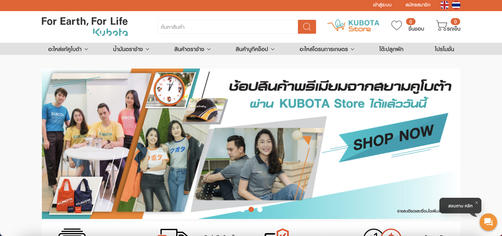

# Kubota Tracking Phase 1

## Introduction

บริษัท Kubota จะมีการทำ tracking กับ website ในเครือของบริษัทจำนวนหลาย website ด้วยกันทั้งหมด 3 website ได้แก่
- siamkubota.co.th (main)
- kubotasolutions.com
- store.siamkubota.co.th

### Webiste หลัก Siam Kubota 

[siamkubota.co.th](https://www.siamkubota.co.th/) คือ website หลักของบริษัท kubota ที่ใช้ในการ ประชาสัมพันธ์ และติดต่อเชื่อมไปยัง website หรือ service อื่นๆในเครือของ kubota เองด้วย

<p align="center">
  
</p>
<br/>

### Website ที่สอง Kubota Solutions

[kubotasolutions.com](https://www.kubotasolutions.com/index.php) คือ website ที่สองของบริษัท Kubota โดย website นี้จะทำหน้าที่เป็นแหล่งรวบรวามความรู้และการเรียนการสอนต่างๆสำหรับเกษตรกร

<p align="center">
  
</p>
<br/>

### Website ที่สาม Kubota Store

[store.siamkubota.co.th](https://store.siamkubota.co.th/) คือ website ที่สามของบริษัท Kubota โดย website นี้จะทำหน้าที่เป็นร้านค้าออนไลน์

<p align="center">
  
</p>
<br/>

## Goal

เป้าหมายหลักของ phase 1 คือการ tracking website ทั้ง 3 ของ บริษัท Kubota แล้วนำเอาข้อมูลเข้าสู่ระบบ Growth โดยจะมี requirements ดังนี้

<p align="center">
  
</p>
<br/>

### 1. Form Tracking (Anonymous)

website ต่างๆของ kubota จะมี Form เพื่อให้ลูกค้ากรอกสำหรับทิ้งข้อมูลการติดต่อเอาไว้ อย่างไรก็ตามเนื่องจากปัญหาด้าน consent ทำให้เราไม่สามารถ track form ของ website ในระบบทั้งหมดได้

<p align="center">
  
</p>
<br/>

### 2. User Registraion/Login Tracking (Member)

User ที่ทำการ login หรือ registration เข้ามาในระบบควรจะสามารถยืนยันตัวตนบนระบบ `Growth` ได้

<p align="center">
  
</p>
<br/>

## Implementation for Goal 2 (User Registration/Login Tracking)

สำหรับการ track Anonymous user ใน goal ที่ 1 นั้นสามารถทำงานได้โดยไม่ต้องเพิ่มเติม logic ในขณะที่การ track logged in หรือ registered users นั้นจำเป็นต้องทำการหาข้อมูลเพื่อทำการ identify users บนระบบ Kubota นั้นตรงกับ lead ไหนบน Growth หรือไม่

### 1. HTML Input สำหรับ Tracking 

เพื่อให้สามารถ track user ที่ทำการ login เข้าสู่ระบบ web kubota ได้นั้นทางทีมจึงอยากรบกวนทีมคูโบต้าให้ทำการเพิ่ม html input element ที่บรรจุข้อมูล user หลังการทำการ login หรือ regis เข้าสู่ระบบ web kubota โดยทาง `Growth` จะใช้ `AzureId` เป็น key ที่ใช้ในการค้นหา User ภายในระบบ

<p align="center">
  
</p>
<br/>

**HTML Input Spec**

```html
<input id="mtc_info" type="hidden" value="firstname:lastname:email:phone:event:azureId" />
```

จาก spec ขั้นต้นจะเป็น `html input element` ที่เป็น `type=hidden` และมี value ด้วยกัน 5 อย่างประกอบด้วย และมี `id=mtc_info`

1. firstname ⇒ ชื่อลูกค้า
2. lastname ⇒ นามสกุลลูกค้า
3. email ⇒ email ลูกค้า
4. phone ⇒ เบอร์โทรศัพท์ลูกค้า
5. event (`login` | `register`) ⇒ event ที่ใช้ระบุว่าลูกค้าเข้าสู่ระบบด้วยการ login หรือการ registration
6. azureId ⇒ azureId ของ user ที่ทำการ login หรือ registration เข้ามา 

> event และ azureId เป็นข้อมูลที่สำคัญมากสำหรับการ tracking ถ้าหากขาดข้อมูลเหล่านี้ไประบบ anlytics ของ growth จะไม่สามารถทำงานได้

**ตัวอย่าง**

```html
<input id="mtc_info" type="hidden" value="ธนกิจ:บำเพ็ญบุญ:thanakij123@gmail.com:0831234577:login:akjd81-asdf-ajsdif-cfasd1" />
```

1. firstname ⇒ `ธนกิจ`
2. lastname ⇒ `บำเพ็ญบุญ`
3. email ⇒ `thanakij123@gmail.com`
4. phone ⇒ `0831234577`
5. event ⇒ `login`
6. azureId ⇒ `akjd81-asdf-ajsdif-cfasd1`

<p align="center">
  
</p>
<br/>

โดยเมื่อทำการติดตั้ง html input element ตัวนี้แล้วระบบ growth จะสามารถนำข้อมูลตรงนี้ไปใช้ในการ track กิจกรรมของลูกค้ที่เกิดขึ้นบน web site kubota ต่อไปได้
<br/>

### 2. API สำหรับ ดึงข้อมูล user ด้วย AzureId ที่ใช้ในการ update ข้อมูล lead บน Growth

`API` เส้นนี้จะใช้ในการดึงข้อมูลส่วนที่เหลือสำหรับการนำไปวิเคราะห์ข้อมูลต่อบนระบบ `Growth` โดยตัว `API` นี้ทางทีมอยากให้มี spec ดังนี้ 

1. query ด้วย query string `azureId`
2. ใช้ Header `Authorization: <API_KEY>` สำหรับการ authentication

```sh
# get an userinfo 
# get from all kubota websites

GET /users?azureId=akjd81-asdf-ajsdif-cfasd1
-H 'Authorization: <API_KEY>'

> { 
  "azure_id": "b441c009-d80b-4e1b-b8d2-deef3c1b69ce",
  "kubota_id": "95NAE026l4",
  "member_type": 4,
  "email": "sukomate@gmail.com",
  "personal_id": "1.102E+12",
  "mobile_login": "956364591",
  "member_point": 3249,
  "member_login": 319,
  "display_name": null,
  "fname": "Sukomate",
  "lname": "Thanombuddha",
  "mobile": "956364591",
  "birthdate": "28/8/1987",
  "addr1": "326/999",
  "addr2": "บ้านกลางเมืองงามวงศ์วาน",
  "addr3": "งามวงศ์วาน",
  "addr4": "ทุ่งสองห้อง",
  "addr5": "หลักสี่",
  "province_id": "1",
  "amphur_id": null,
  "district_id": null,
  "zipcode": "10210",
  "annual_income": null,
  "friend_code": "HVD73D3",
  "product_interested": null,
  "have_kubota_machine": null,
  "latitude": null,
  "longitude": null,
  "parent_account_token": null,
  "area_all": 10,
  "area_rice_sel": 0,
  "area_rice": 0,
  "area_oil_palm_sel": 0,
  "area_oil_palm": 0,
  "area_corn_sel": 0,
  "area_corn": 0,
  "area_sugar_cane_sel": 0,
  "area_sugar_cane": 0,
  "area_rubber_tree_sel": 0,
  "area_rubber_tree": 0,
  "area_soybean_sel": 0,
  "area_soybean": 0,
  "area_cassava_sel": 0,
  "area_cassava": 0,
  "area_others_sel": 0,
  "area_others": 0,
  "created": "30/1/2017 10:03",
  "updated": "29/11/2019 18:30"
}
```

ในกรณีที่ API error 

```json
// Sample 404 status
{
  "statusCode" : 404,
  "description": "Not Found"
}
```

ภาพรวมการทำงานของ `Growth` คู่กับ Kubota สำหรับ flow `login` และ  `registration`

<p align="center">
  
</p>
<br/>